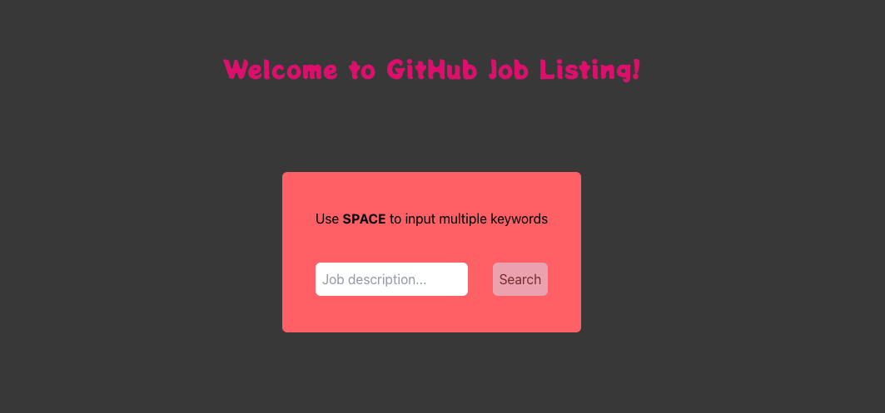

# TypeScript version with Tailwind
[Demo link](https://git-jobs-ts.web.app/)



## Test code snippet
- `yarn test src/Components/__test__/JobListItem.test.tsx`
- `yarn test src/Components/__test__/JobDetail.test.tsx`
- `yarn test src/App.test.tsx`

> Coverage is poorly printed. Function test and state test will need more time, will not continue with this project anymore.

Convert old js version into ts, including tests.

Implemented Tailwind for styling (very simple and basic, just for testing's purpose)

---
## DONE

- check **@apply {}** (maybe only for components' level not for page?? to be checked) <- yes, you are correct.
- 
```css
@layer components {
  .editBtn {
    @apply px-4 py-2 font-Montserrat text-gray-100 bg-indigo-300 rounded-md transform hover:bg-indigo-500 duration-200 ease-in-out;
  }

  .primaryBtn {
    @apply px-5 py-2 mt-5 ml-auto block bg-primary rounded-md text-dark font-Amaranth;
  }
}
```
Write such kind of lines of code in index.css and you will get back your own customized class name for these styles conbination.
